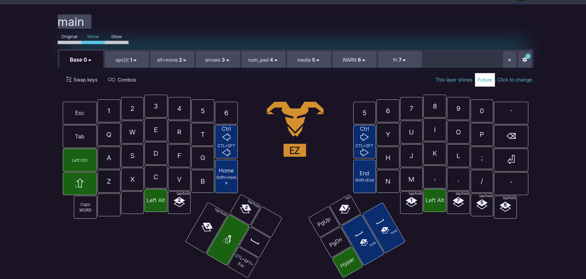
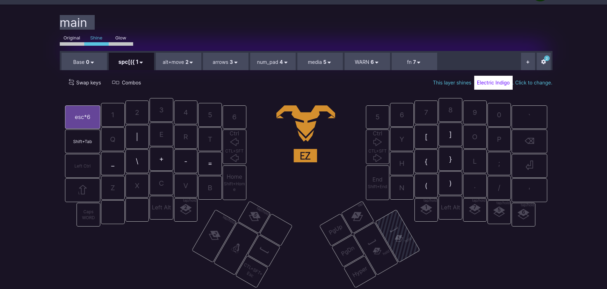
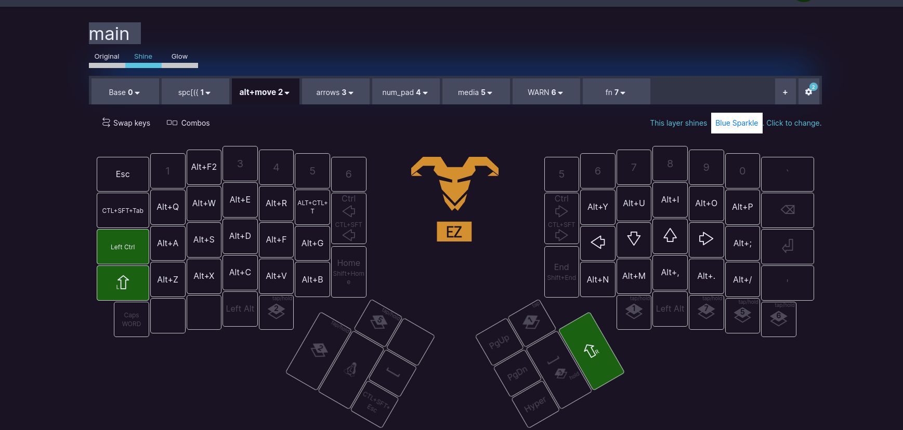
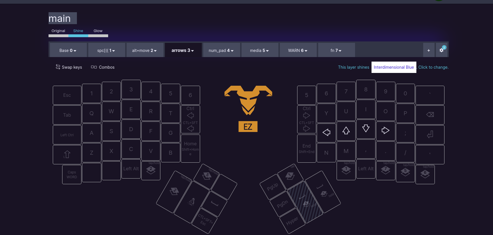
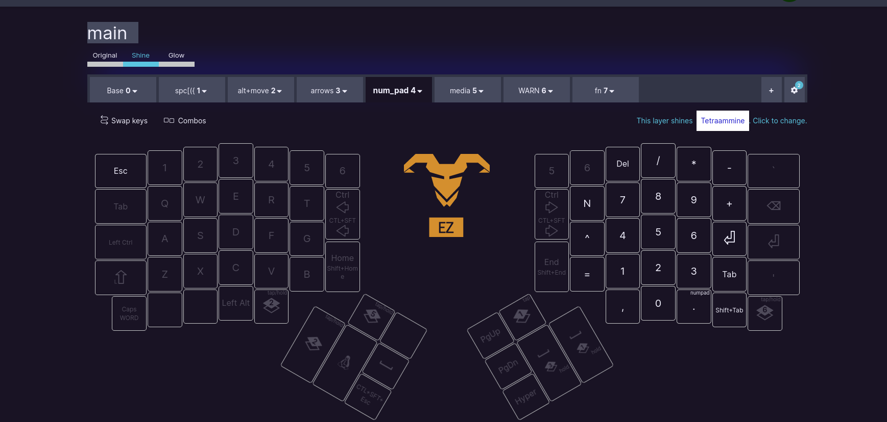
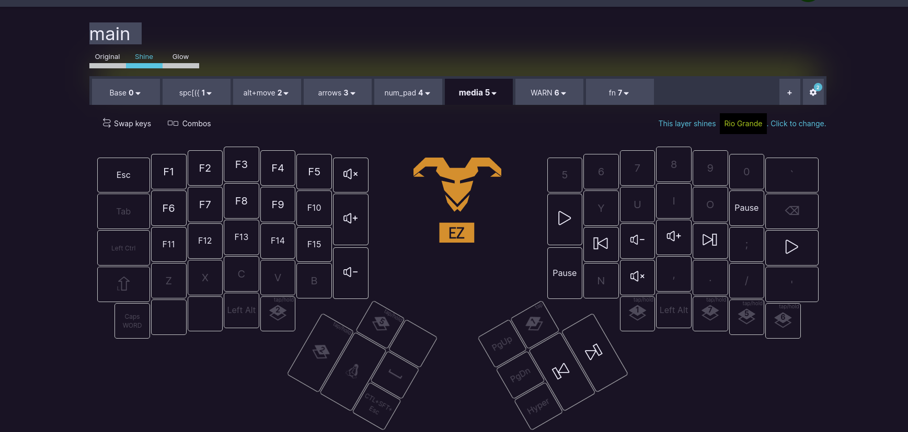
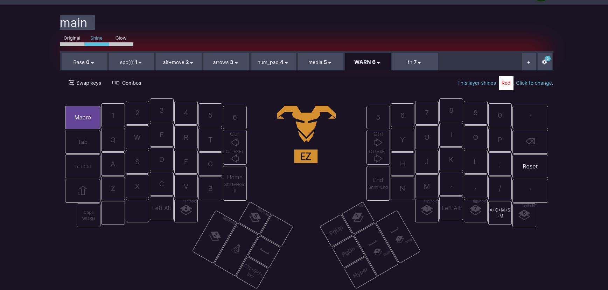

# ergodox_settings











### current is WrKY4

* https://configure.zsa.io/ergodox-ez/layouts/WrKY4/latest/0  
* [ergodox-zsa](https://configure.zsa.io/ergodox-ez/layouts/WrKY4/latest/0 )

#### Steps to flash board:
1. Open __current__ layout
2. Update and save to: `~/Downloads/ergodox_layouts/`
3. Run the following command:  
```bash
sudo wally
```
4. Have a paperclip ready, and flash the board.


### More Info/Links:
* [ __oryx__ ](https://configure.zsa.io/my_layouts ) - MOST USEFUL LINK
* [wally](https://ergodox-ez.com/pages/wally ) is the keyboard flashing firmware 
    * wally executeable is in the following location: `/usr/local/bin/wally`
* [ergodox-ez website](https://ergodox-ez.com/ )


02-02-23
