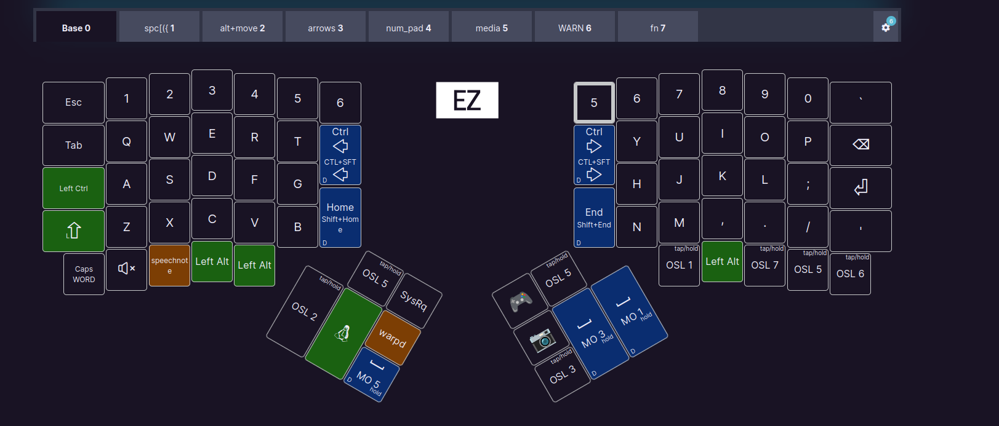
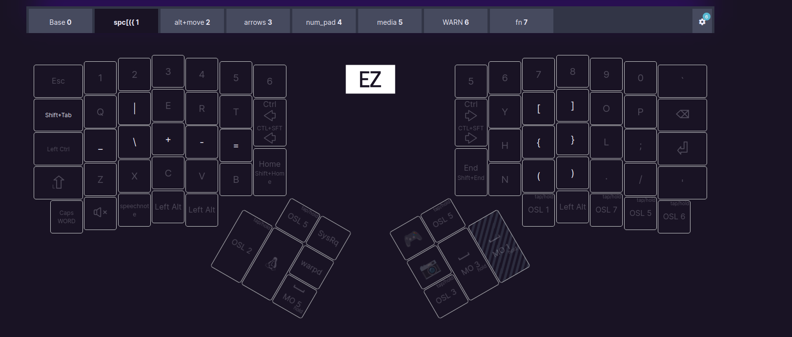
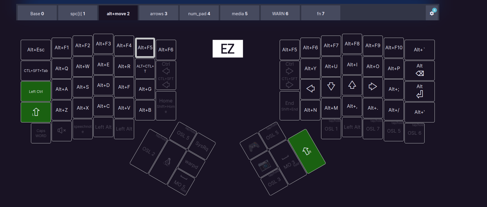
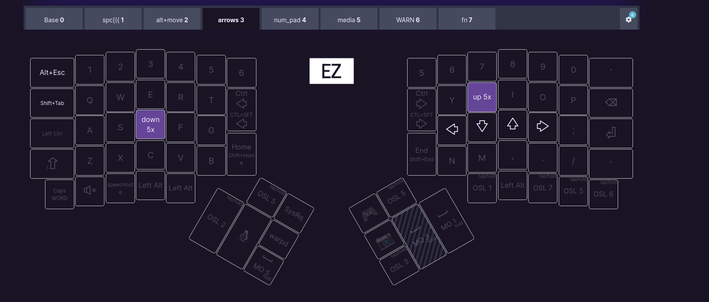
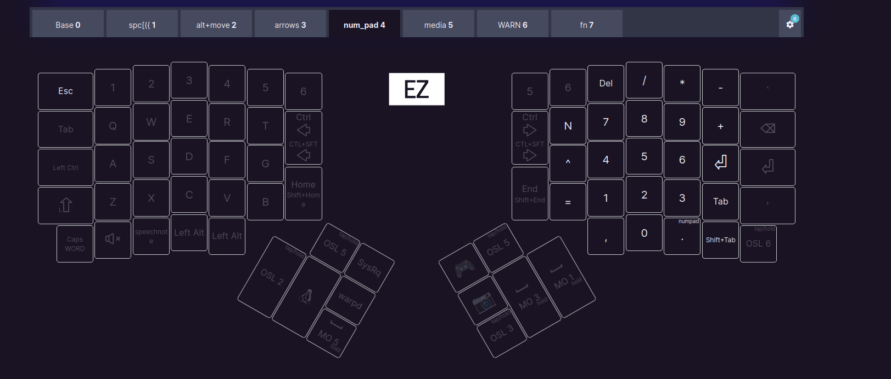
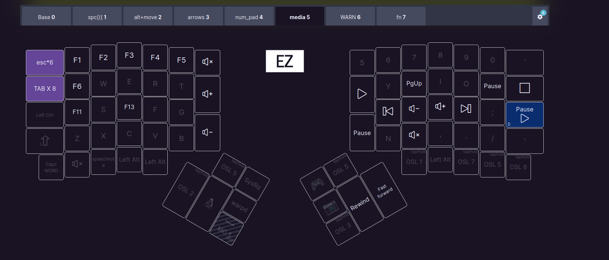
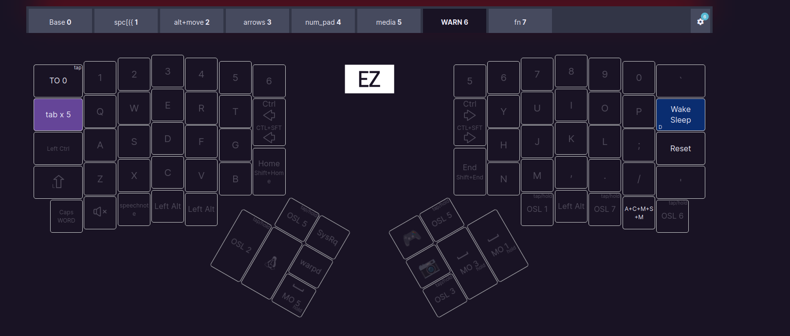
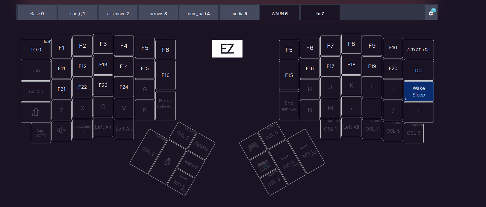

# ERGODOX SETTINGS & LAYOUTS

Here is where I store my ergodox-ez compiled firmware flashing files + helpful docs/notes I've come across while using this board.

> [!NOTE]
> One day when I am less poor and busy, I will attempt to convert the ergodox housing to a electro-capacitive (topre) style board.
>
> ATM I am using lubed and spring swapped durock shrimp silent tactile switches, which are the closest replication to the topre feeling I miss from my HHKB.
>
> For anyone who is interested in working on building a ec ergodox/torpedox/bigger split ec board, please reach out!

## Quick links

- [ORYX](https://configure.zsa.io/) - web-based layout editor and firmware compiler for zsa keyboards (ergodox ez, moonlander, planck ez, voyager)
- [ZSA](https://www.zsa.io/voyager) - homepage for zsa, the company that makes the ergodox ez, moonlander, planck ez, and voyager keyboards
- [WALLY](https://ergodox-ez.com/pages/wally) - old firmware flashing software for zsa keyboards (seems to be more reliable than keymapp, in my experience)
- [KEYMAPP](https://www.zsa.io/flash) - newer firmware flashing software for zsa keyboards

## Layouts

> [!WARNING]
> Apologies if the screenshots contain minor inconsistencies. I tend to update them in batches

- [current layout](https://configure.zsa.io/ergodox-ez/layouts/5JXdX/latest/0) `5JXdX` `main [fork]`

  
  
  
  
  
  
  
  

- [older layout](https://configure.zsa.io/ergodox-ez/layouts/WrKY4/latest/0) `WrKY4` `[main]`

## [KEYMAPP INSTALLATION](https://github.com/zsa/wally/wiki/Linux-install)

### install dependencies

```fish
sudo apt install libwebkit2gtk-4.1-0 libgtk-3-0 libusb-1.0-0

# create a udev rule
sudo touch /etc/udev/rules.d/50-zsa.rules
sudo $EDITOR /etc/udev/rules.d/50-zsa.rules
```

Paste the following into the file:

```txt
# Rules for Oryx web flashing and live training
KERNEL=="hidraw*", ATTRS{idVendor}=="16c0", MODE="0664", GROUP="plugdev"
KERNEL=="hidraw*", ATTRS{idVendor}=="3297", MODE="0664", GROUP="plugdev"

# Legacy rules for live training over webusb (Not needed for firmware v21+)
  # Rule for all ZSA keyboards
  SUBSYSTEM=="usb", ATTR{idVendor}=="3297", GROUP="plugdev"
  # Rule for the Moonlander
  SUBSYSTEM=="usb", ATTR{idVendor}=="3297", ATTR{idProduct}=="1969", GROUP="plugdev"
  # Rule for the Ergodox EZ
  SUBSYSTEM=="usb", ATTR{idVendor}=="feed", ATTR{idProduct}=="1307", GROUP="plugdev"
  # Rule for the Planck EZ
  SUBSYSTEM=="usb", ATTR{idVendor}=="feed", ATTR{idProduct}=="6060", GROUP="plugdev"

# Wally Flashing rules for the Ergodox EZ
ATTRS{idVendor}=="16c0", ATTRS{idProduct}=="04[789B]?", ENV{ID_MM_DEVICE_IGNORE}="1"
ATTRS{idVendor}=="16c0", ATTRS{idProduct}=="04[789A]?", ENV{MTP_NO_PROBE}="1"
SUBSYSTEMS=="usb", ATTRS{idVendor}=="16c0", ATTRS{idProduct}=="04[789ABCD]?", MODE:="0666"
KERNEL=="ttyACM*", ATTRS{idVendor}=="16c0", ATTRS{idProduct}=="04[789B]?", MODE:="0666"

# Keymapp / Wally Flashing rules for the Moonlander and Planck EZ
SUBSYSTEMS=="usb", ATTRS{idVendor}=="0483", ATTRS{idProduct}=="df11", MODE:="0666", SYMLINK+="stm32_dfu"
# Keymapp Flashing rules for the Voyager
SUBSYSTEMS=="usb", ATTRS{idVendor}=="3297", MODE:="0666", SYMLINK+="ignition_dfu"
```

Lastly make sure user is part of `plugdev` _group_:

```fish
sudo groupadd plugdev
sudo usermod -aG plugdev $USER
```

### create a desktop entry

```fish
# create the necessary directories
mkdir -p ~/.local/share/applications  # for desktop entry
mkdir -p ~/.local/opt/keymapp        # for the application itself

# move the downloaded dir to the right place
mv ~/Downloads/keymapp-latest/* ~/.local/opt/keymapp/

# create a symlink to the executable
ln -s ~/.local/opt/keymapp/keymapp ~/.local/bin/keymapp

# create a executable
chmod +x ~/.local/opt/keymapp/keymapp

#create a desktop entry
echo '[Desktop Entry]
Type=Application
Name=Keymapp
GenericName=Keyboard Configuration Tool
Comment=ErgoDox Keyboard Configuration Tool
Exec=keymapp
Icon=keymapp
# Categories=System;Settings;Utility;
Categories=Settings;HardwareSettings;
Terminal=false
Version=1.0
StartupNotify=true
Keywords=keyboard;ergodox;configuration;keymap;
NoDisplay=false' > ~/.local/share/applications/keymapp.desktop

# make the desktop entry executable
chmod +x ~/.local/share/applications/keymapp.desktop

# Create the icons directory if it doesn't exist
mkdir -p ~/.local/share/icons/hicolor/scalable/apps/

# Copy the icon to the icons directory with a simple name
cp ~/.local/opt/keymapp/icon.png ~/.local/share/icons/hicolor/scalable/apps/keymapp.png

# 3. Update the desktop database
update-desktop-database ~/.local/share/applications

# Update icon cache
gtk-update-icon-cache -f -t ~/.local/share/icons

# (OPTIONAL) Refresh the application cache
gtk-update-icon-cache -f -t ~/.local/share/icons

```

## KEYBOARD-SHORTCUTS

- _super+b_ - open `btop` (process list CLI)
- _super+e_ - open browser `firefox`
- _super+t_ - open terminal `alacritty`
- _super+r_ - open ranger (file manager CLI)
- _super+1_ - start `wrapd` in one shot mode (control mouse w/ vim navigation, but only for one command)
- _super+2_ - start `wrapd` in normal mode (control mouse w/ vim navigation until `esc`)
- _super+f_ - open `nautilus` (file manager)
- _super+c_ - open clipboard manager gui
- _super+n_ - select next clipboard item in clipboard manager
- _super+p_ - select previous clipboard item in clipboard manager

> [!NOTE]
> Most other system level shortcuts I use with this keyboard configuration is tied to `pop!_os` and `gnome` defaults, which essentially just make `super+[hjkl]` and other vim motions work for window management and workspace management.

<!-- ### current is WrKY4 -->
<!---->
<!-- - [current](https://configure.zsa.io/ergodox-ez/layouts/WrKY4/latest/0)   -->
<!-- - [ergodox-zsa](https://configure.zsa.io/ergodox-ez/layouts/WrKY4/latest/0 ) -->

## Steps to flash board w/ 'wally'

1. Open __current__ layout
1. Update and save to: `~/Downloads/ergodox_layouts/`
1. Run the following command:

  ```bash
  sudo wally
  ```

1. Either `L5+Enter` (`L5` is the bottom right most key) or Have a paperclip ready, and flash the board.

### More Info/Links

- [__oryx__](https://configure.zsa.io/my_layouts ) - MOST USEFUL LINK
- [keymapp](https://github.com/zsa/wally/wiki/Linux-install) is the __new__ flashing firmware
- [wally](https://ergodox-ez.com/pages/wally) is the __old__ keyboard flashing firmware
  - wally executable is in the following location: `/usr/local/bin/wally`
- [ergodox-ez website](https://ergodox-ez.com/ )
