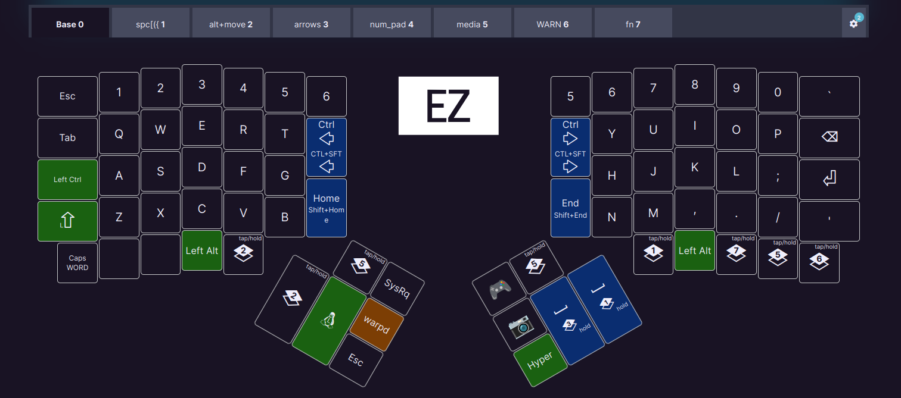

# ergodox_settings

- [current layout](https://configure.zsa.io/ergodox-ez/layouts/WrKY4/latest/0)




## [keymapp](https://github.com/zsa/wally/wiki/Linux-install)

### install dependencies

```fish
sudo apt install libwebkit2gtk-4.1-0 libgtk-3-0 libusb-1.0-0

# create a udev rule
sudo touch /etc/udev/rules.d/50-zsa.rules
sudo $EDITOR /etc/udev/rules.d/50-zsa.rules
```

Paste the following into the file:

```txt
# Rules for Oryx web flashing and live training
KERNEL=="hidraw*", ATTRS{idVendor}=="16c0", MODE="0664", GROUP="plugdev"
KERNEL=="hidraw*", ATTRS{idVendor}=="3297", MODE="0664", GROUP="plugdev"

# Legacy rules for live training over webusb (Not needed for firmware v21+)
  # Rule for all ZSA keyboards
  SUBSYSTEM=="usb", ATTR{idVendor}=="3297", GROUP="plugdev"
  # Rule for the Moonlander
  SUBSYSTEM=="usb", ATTR{idVendor}=="3297", ATTR{idProduct}=="1969", GROUP="plugdev"
  # Rule for the Ergodox EZ
  SUBSYSTEM=="usb", ATTR{idVendor}=="feed", ATTR{idProduct}=="1307", GROUP="plugdev"
  # Rule for the Planck EZ
  SUBSYSTEM=="usb", ATTR{idVendor}=="feed", ATTR{idProduct}=="6060", GROUP="plugdev"

# Wally Flashing rules for the Ergodox EZ
ATTRS{idVendor}=="16c0", ATTRS{idProduct}=="04[789B]?", ENV{ID_MM_DEVICE_IGNORE}="1"
ATTRS{idVendor}=="16c0", ATTRS{idProduct}=="04[789A]?", ENV{MTP_NO_PROBE}="1"
SUBSYSTEMS=="usb", ATTRS{idVendor}=="16c0", ATTRS{idProduct}=="04[789ABCD]?", MODE:="0666"
KERNEL=="ttyACM*", ATTRS{idVendor}=="16c0", ATTRS{idProduct}=="04[789B]?", MODE:="0666"

# Keymapp / Wally Flashing rules for the Moonlander and Planck EZ
SUBSYSTEMS=="usb", ATTRS{idVendor}=="0483", ATTRS{idProduct}=="df11", MODE:="0666", SYMLINK+="stm32_dfu"
# Keymapp Flashing rules for the Voyager
SUBSYSTEMS=="usb", ATTRS{idVendor}=="3297", MODE:="0666", SYMLINK+="ignition_dfu"
```

Lastly make sure user is part of `plugdev` _group_:

```fish
sudo groupadd plugdev
sudo usermod -aG plugdev $USER
```

### create a desktop entry

```fish
# create the necessary directories
mkdir -p ~/.local/share/applications  # for desktop entry
mkdir -p ~/.local/opt/keymapp        # for the application itself

# move the downloaded dir to the right place
mv ~/Downloads/keymapp-latest/* ~/.local/opt/keymapp/

# create a symlink to the executable
ln -s ~/.local/opt/keymapp/keymapp ~/.local/bin/keymapp

# create a executable
chmod +x ~/.local/opt/keymapp/keymapp

#create a desktop entry
echo '[Desktop Entry]
Type=Application
Name=Keymapp
GenericName=Keyboard Configuration Tool
Comment=ErgoDox Keyboard Configuration Tool
Exec=keymapp
Icon=keymapp
# Categories=System;Settings;Utility;
Categories=Settings;HardwareSettings;
Terminal=false
Version=1.0
StartupNotify=true
Keywords=keyboard;ergodox;configuration;keymap;
NoDisplay=false' > ~/.local/share/applications/keymapp.desktop

# make the desktop entry executable
chmod +x ~/.local/share/applications/keymapp.desktop

# Create the icons directory if it doesn't exist
mkdir -p ~/.local/share/icons/hicolor/scalable/apps/

# Copy the icon to the icons directory with a simple name
cp ~/.local/opt/keymapp/icon.png ~/.local/share/icons/hicolor/scalable/apps/keymapp.png

# 3. Update the desktop database
update-desktop-database ~/.local/share/applications

# Update icon cache
gtk-update-icon-cache -f -t ~/.local/share/icons

# (OPTIONAL) Refresh the application cache
gtk-update-icon-cache -f -t ~/.local/share/icons

```

## KEYBOARD-SHORTCUTS

- _super+b_ - open btop (process list CLI)
- _super+e_ - open browser
- _super+t_ - open terminal
- _super+r_ - open ranger (file manager CLI)

### current is WrKY4

- [current](https://configure.zsa.io/ergodox-ez/layouts/WrKY4/latest/0)  
- [ergodox-zsa](https://configure.zsa.io/ergodox-ez/layouts/WrKY4/latest/0 )

### Steps to flash board w/ 'wally'

1. Open __current__ layout
1. Update and save to: `~/Downloads/ergodox_layouts/`
1. Run the following command:

  ```bash
  sudo wally
  ```

1. Either `L5+Enter` or Have a paperclip ready, and flash the board.

### More Info/Links

- [__oryx__](https://configure.zsa.io/my_layouts ) - MOST USEFUL LINK
- [keymapp](https://github.com/zsa/wally/wiki/Linux-install) is the __new__ flashing firmware
- [wally](https://ergodox-ez.com/pages/wally) is the __old__ keyboard flashing firmware
  - wally executable is in the following location: `/usr/local/bin/wally`
- [ergodox-ez website](https://ergodox-ez.com/ )

